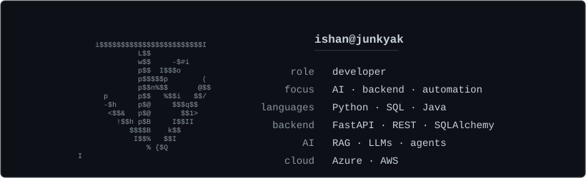
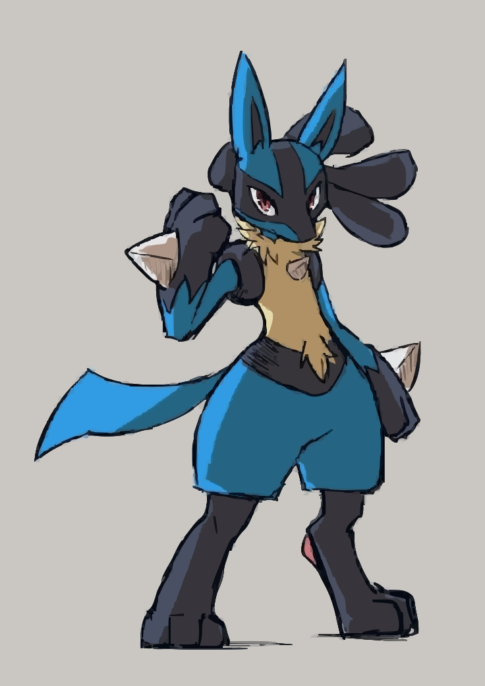

<h1 align="center">
  Hey, I'm Ishan 👋 
  <code>ishan@junkyak</code> · India
</h1>

  I build AI, backend, and automation systems, 
  turning complex workflows into useful software.

  

  
  &nbsp;&nbsp;
  

  
· · ·

  

    you found the fine print.
  

 

  

